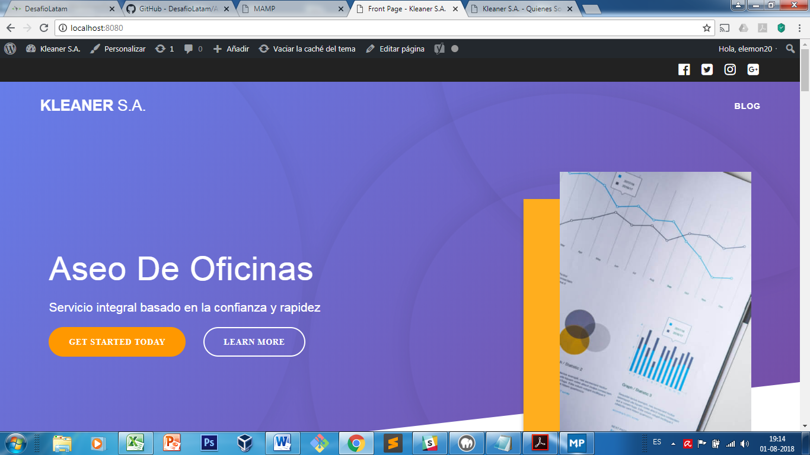
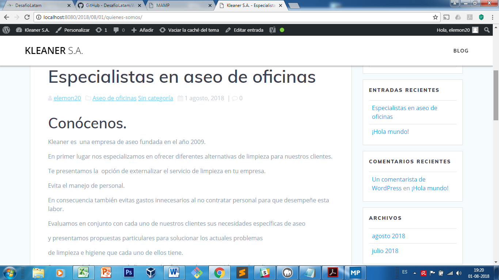

#Creación de contenido para la empresa Kleaner.
_____________________________________________

####descripción del proceso:

Una vez descargado wordpress y creada la base de datos de manera local procedí a descargar y activar la planilla **mesmerize**, descarge los plugins requeridos por la plantilla, hice los cambios solicitados dejando la página de inicio estatica y el blog con las entradas. 

Analizados los datos entregados para la creación de contenido busque por medio de **Ubersuggest** las keywords mas usadas según las palabras claves entregadas, obteniendo como resultado lo siguiente:

		Categoria	Keyword		Volumen de búsqueda		Competencia
			
		aseo		limpieza			2900				0,28
					aseo				2400				0,09
					aseo oficinas		320					0,8
					aseo y limpieza		90					0,26
					empresa aseo
					oficinas			10					0,97
		limpieza de
		oficinas	aseo oficinas		320					0,8
					empresas de 
					aseo oficinas		210					0,92
					servicio de 
					aseo oficinas		30					0,9
					empresa aseo 
					oficinas			10					0,97
		Servicio de
		limpieza	empresas de aseo	3600				0,78
					aseo a domicilio	1000				0,64
					empresas de
					limpieza			210					0,52
					servicio de aseo	260					0,54
					servicio de
					limpieza			210					0,52
					aseo integral		40					0,53
					de limpieza			30					0,56
					servicio aseo		30					0,56
					servicio de 
					limpieza empresas	20					0,8
					nombres de 
					empresas de
					limpieza			20					0,55
					servicio limpieza	20					0,53
					limpieza integral	20					0,32
					empresas de 
					limpieza de
					oficinas			20					0,21

Una vez obtenido lo anterior cree la siguiente entrada utilizando las palabras claves de menor competencia y optimizada por medio del plugins YOAST SEO:

		Especialistas en aseo de oficinas.

	Kleaner es  una empresa de aseo fundada en el año 2009.

	En primer lugar nos especializamos en ofrecer diferentes alternativas de limpieza para nuestros clientes.

	Te presentamos la  opción de externalizar el servicio de limpieza en tu empresa.

	Evita el manejo de personal.

	En consecuencia también evitas gastos innecesarios al no contratar personal para que desempeñe esta labor.

	Evaluamos en conjunto con cada uno de nuestros clientes sus necesidades específicas de aseo

	y presentamos propuestas particulares para solucionar los actuales problemas

	de limpieza e higiene que cada uno de ellos tiene.

	Somos una de las empresas de limpieza de oficinas más reconocidas en el medio,

	nuestros clientes nos abalan, contamos con los mayores estándares de limpieza,

	responsabilidad, confianza y rapidez.

	Actualmente prestamos el servicio de limpieza a empresas en el área metropolitana,

	nuestros clientes son empresas  grandes y medianas.

	Prestamos los siguientes servicios de aseo:

	Limpieza Oficinas:
	Horarios diurnos, nocturnos y mixtos, con personal seleccionado y capacitado.

	Además tenemos gente profesional, personal de apoyo, insumos, equipo industrial y productos químicos especializados.

	Limpieza de cristales:
	Unos cristales manchados no solo transmiten una imagen de falta de profesionalidad sino que impiden el disfrute de la luz natural en su plenitud.

	Este servicio está disponible para la limpieza tanto interior como exterior de las edificaciones o empresas.

	Limpieza de muebles:
	Realizamos la tarea de limpieza de tapizados en sillones, sofás y paredes enteladas, con las mejores técnicas y procedimientos para ellos.

	Limpieza personalizada:
	Realizamos visitas para trabajos especiales, totales o parciales en su oficina o empresa, debido a esto, nos adaptamos a tus necesidades de higiene y presupuesto,

	entregando como resultado un servicio óptimo.
	
	Como puedes ver somos una empresa que busca la satisfacción de nuestros clientes.
	
	Nuestros colaboradores estarán siempre dispuestos a ayudarte y brindarte soluciones.
	
	!Finalmente danos la oportunidad de atenderte¡

_______________________________________________________________

